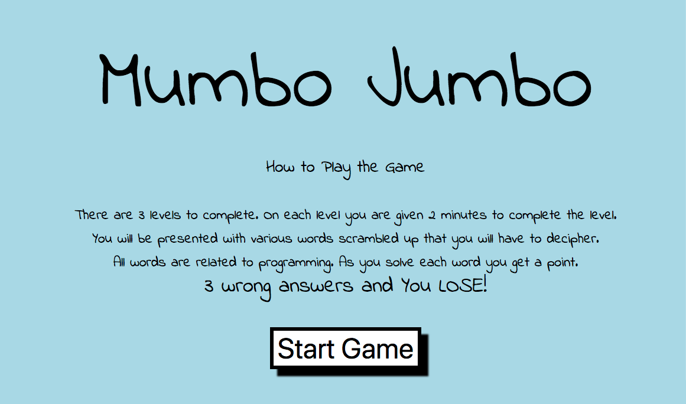
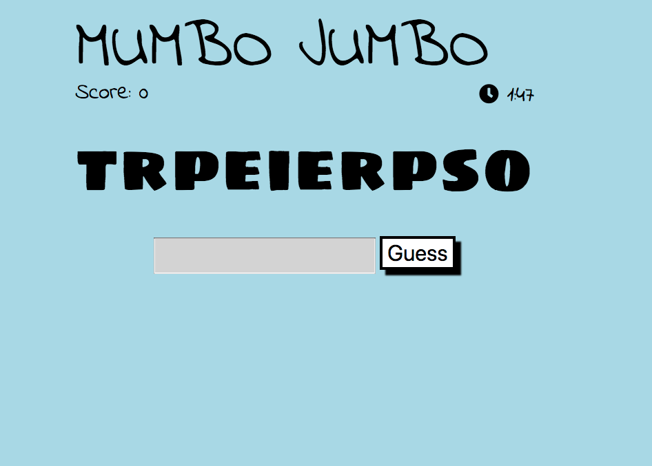

# 
Welcome to Mumbo Jumbo - a word scramble game. 

A word scramble game created with MongoDB, Express  &amp; NodeJS

	 
	  

 
## Will you take the challenge? Hoew many words can you unscramble in 2 minutes?  

## This project was created with HTML/CSS, Javascript, NodeJS, Express, MySQL & a sprinkle of Jquery for animation and hosted on Heroku.  

## Enough chit chat let's put your knowledge of programming terminology to the test.  
## Play Mumbo Jumbo  https://mumbojumbo.herokuapp.com
